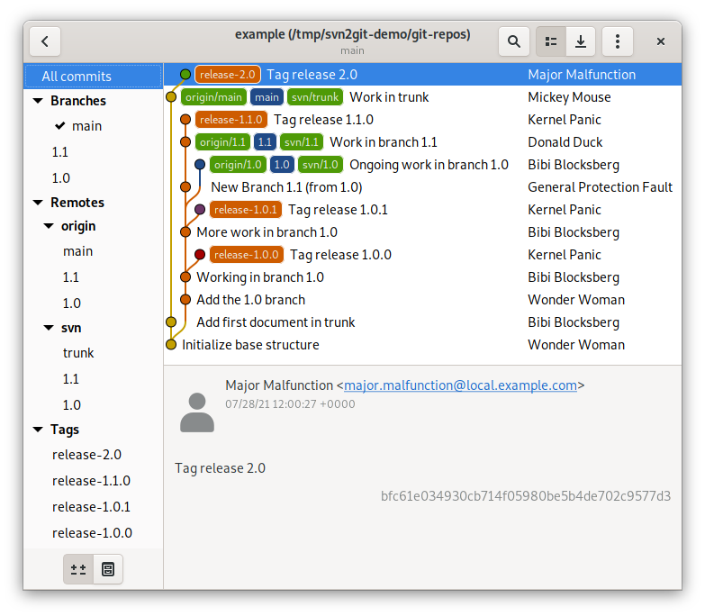

# svn2git example

Small walkthrough to demonstrate the usage of the scripts

## 0. Create the subversion repository

This is a Subversion repository set up for demonstration purposes,
using a dump that head been created some weeks earlier.
It is accessible through the URL `file:///tmp/svn2git-demo/svn-repos/example`
on the local machine only.

In a real use case, this repository would already exist.

```
user@machine [~] $ mkdir -p /tmp/svn2git-demo/svn-repos
user@machine [~] $ svnadmin create /tmp/svn2git-demo/svn-repos/example
user@machine [~] $ svnadmin load /tmp/svn2git-demo/svn-repos/example < example.dump
<<< Started new transaction, based on original revision 1
     * editing path : branches ... done.
     * editing path : tags ... done.
     * editing path : trunk ... done.

------- Committed revision 1 >>>

<<< Started new transaction, based on original revision 2
     * editing path : trunk/README.md ... done.

------- Committed revision 2 >>>

<<< Started new transaction, based on original revision 3
     * editing path : branches/1.0 ...COPIED... done.
     * editing path : branches/1.0/README.md ...COPIED... done.

------- Committed revision 3 >>>

<<< Started new transaction, based on original revision 4
     * editing path : branches/1.0/README.md ... done.
     * editing path : branches/1.0/changes.md ... done.

------- Committed revision 4 >>>

<<< Started new transaction, based on original revision 5
     * editing path : tags/release-1.0.0 ...COPIED... done.

------- Committed revision 5 >>>

<<< Started new transaction, based on original revision 6
     * editing path : branches/1.0/changes.md ... done.

------- Committed revision 6 >>>

<<< Started new transaction, based on original revision 7
     * editing path : tags/release-1.0.1 ...COPIED... done.

------- Committed revision 7 >>>

<<< Started new transaction, based on original revision 8
     * editing path : branches/1.1 ...COPIED... done.

------- Committed revision 8 >>>

<<< Started new transaction, based on original revision 9
     * editing path : branches/1.0/new-file.md ... done.

------- Committed revision 9 >>>

<<< Started new transaction, based on original revision 10
     * editing path : branches/1.1/changes.md ... done.

------- Committed revision 10 >>>

<<< Started new transaction, based on original revision 11
     * editing path : tags/release-1.1.0 ...COPIED... done.

------- Committed revision 11 >>>

<<< Started new transaction, based on original revision 12
     * editing path : trunk/changes.md ... done.

------- Committed revision 12 >>>

<<< Started new transaction, based on original revision 13
     * editing path : tags/release-2.0 ...COPIED... done.

------- Committed revision 13 >>>

user@machine [~] $
```

## 1. Determine SVN repository authors

```
user@machine [~] $ ~/python-svn2git/unique_commit_authors.py file:///tmp/svn2git-demo/svn-repos/example > example-authors.txt
INFO    ║ unique_commit_authors.py v2.5.0-rc2 started at 2021-08-12 15:06:50.853789
INFO    ║ Repository Root: file:///tmp/svn2git-demo/svn-repos/example
INFO    ║ HEAD Revision:   13
INFO    ║ ------------------------------------------------------------------------
INFO    ║ Reading the SVN log in chunks of 5000 revisions
INFO    ║ Examined 13 revisions
INFO    ║ ------------------------------------------------------------------------
INFO    ║ "svn log" highest returncode: 0
INFO    ║ ------------------------------------------------------------------------
INFO    ║ unique_commit_authors.py statistics
INFO    ║ ------------------------------------------------------------------------
INFO    ║ Examined 13 revisions in 0.047 seconds
INFO    ║ (ø 277.4 revisions per second).
INFO    ║ ------------------------------------------------------------------------
INFO    ║ unique_commit_authors.py v2.5.0-rc2 finished at 2021-08-12 15:06:50.901532
user@machine [~] $
user@machine [~] $ cat example-authors.txt
user1
user2
releasemanager
project-admin
user3
user4
major-release-manager
user@machine [~] $
```

## 2. Create the authors.txt file

```
user@machine [~] $ vim example-authors.txt
user@machine [~] $ cat example-authors.txt
user1 = Wonder Woman <wonder.woman@local.example.com>
user2 = Bibi Blocksberg <bibi.blocksberg@local.example.com>
releasemanager = Kernel Panic <colonel.panic@local.example.com>
project-admin = General Protection Fault <general.protection.fault@local.example.com>
user3 =  Donald Duck <donald.duck@local.example.com>
user4 =  Mickey Mouse <mickey.mouse@local.example.com>
major-release-manager = Major Malfunction <major.malfunction@local.example.com>
user@machine [~] $
```

## 3. Do the migration

The script autodetects the name of the inital branch.
In this case, that branch is named `main` according to my global setting
of the `init.defaultbranch` Git option.

```
user@machine [~] $ mkdir -p /tmp/svn2git-demo/git-repos/example
user@machine [~] $ cd /tmp/svn2git-demo/git-repos/example
user@machine [example] $ ~/python-svn2git/svn2git.py --authors ~/example-authors.txt file:///tmp/svn2git-demo/svn-repos/example
INFO    ║ svn2git.py v2.5.0-rc2 started at 2021-08-12 15:13:00.135385
INFO    ║ === Clone ===
INFO    ║ --- Do Git SVN Init ---
INFO    ║ [Executing command] git svn init --prefix=svn/ --no-metadata --trunk=trunk --tags=tags --branches=branches file:///tmp/svn2git-demo/svn-repos/example
Initialized empty Git repository in /tmp/svn2git-demo/git-repos/example/.git/
INFO    ║ Initial branch name: 'main'
INFO    ║ Using authors file: /home/rainer/example-authors.txt
INFO    ║ --- Do Git SVN Fetch ---
INFO    ║ [Executing command] git svn fetch
r1 = 2866c7ef01d7a390979cb1ac858a0fc70017e50a (refs/remotes/svn/trunk)
	A	README.md
r2 = e431ee34b532e854bd429e83fa89d2a555e60bf8 (refs/remotes/svn/trunk)
Found possible branch point: file:///tmp/svn2git-demo/svn-repos/example/trunk => file:///tmp/svn2git-demo/svn-repos/example/branches/1.0, 1
Found branch parent: (refs/remotes/svn/1.0) 2866c7ef01d7a390979cb1ac858a0fc70017e50a
Following parent with do_switch
	A	README.md
Successfully followed parent
r3 = 2c1aede4e0dbf7bac958fe57fc461a3641ff9068 (refs/remotes/svn/1.0)
	M	README.md
	A	changes.md
r4 = 28de707646e0b03fb2ea789ca7f8511aae8578a2 (refs/remotes/svn/1.0)
Found possible branch point: file:///tmp/svn2git-demo/svn-repos/example/branches/1.0 => file:///tmp/svn2git-demo/svn-repos/example/tags/release-1.0.0, 4
Found branch parent: (refs/remotes/svn/tags/release-1.0.0) 28de707646e0b03fb2ea789ca7f8511aae8578a2
Following parent with do_switch
Successfully followed parent
r5 = 180df03d009303a6e39d6cf8394ed9044c598879 (refs/remotes/svn/tags/release-1.0.0)
	M	changes.md
r6 = 4c47857135c490b20a213af4df8b585090e65a21 (refs/remotes/svn/1.0)
Found possible branch point: file:///tmp/svn2git-demo/svn-repos/example/branches/1.0 => file:///tmp/svn2git-demo/svn-repos/example/tags/release-1.0.1, 6
Found branch parent: (refs/remotes/svn/tags/release-1.0.1) 4c47857135c490b20a213af4df8b585090e65a21
Following parent with do_switch
Successfully followed parent
r7 = f53d3dabc82d0778a8278fbb3bfdea6cc7e3203f (refs/remotes/svn/tags/release-1.0.1)
Found possible branch point: file:///tmp/svn2git-demo/svn-repos/example/branches/1.0 => file:///tmp/svn2git-demo/svn-repos/example/branches/1.1, 7
Found branch parent: (refs/remotes/svn/1.1) 4c47857135c490b20a213af4df8b585090e65a21
Following parent with do_switch
Successfully followed parent
r8 = 17fb0edaa4b9ffcf5e3ffe060bb118e06c2bc4c4 (refs/remotes/svn/1.1)
	A	new-file.md
r9 = a957b5ffbfa33dd1e776aedac0776b458a4b9c46 (refs/remotes/svn/1.0)
	M	changes.md
r10 = cf8a93116913278ccbae6058975e8cd5c22fb3db (refs/remotes/svn/1.1)
Found possible branch point: file:///tmp/svn2git-demo/svn-repos/example/branches/1.1 => file:///tmp/svn2git-demo/svn-repos/example/tags/release-1.1.0, 10
Found branch parent: (refs/remotes/svn/tags/release-1.1.0) cf8a93116913278ccbae6058975e8cd5c22fb3db
Following parent with do_switch
Successfully followed parent
r11 = c6b8310f04572536e8c2842a8ef1dd5d69368163 (refs/remotes/svn/tags/release-1.1.0)
	A	changes.md
r12 = 8b6bb5b91393bcc51e91d96f4143a2e70e1cb130 (refs/remotes/svn/trunk)
Found possible branch point: file:///tmp/svn2git-demo/svn-repos/example/trunk => file:///tmp/svn2git-demo/svn-repos/example/tags/release-2.0, 12
Found branch parent: (refs/remotes/svn/tags/release-2.0) 8b6bb5b91393bcc51e91d96f4143a2e70e1cb130
Following parent with do_switch
Successfully followed parent
r13 = bfc61e034930cb714f05980be5b4de702c9577d3 (refs/remotes/svn/tags/release-2.0)
Checked out HEAD:
  file:///tmp/svn2git-demo/svn-repos/example/trunk r12
INFO    ║ --- Get Branches ---
INFO    ║ --- Fix Branches ---
INFO    ║ --- Fix Tags ---
INFO    ║ --- Fix Trunk ---
INFO    ║ --- Optimize Repository ---
INFO    ║ [Executing command] git gc
Enumerating objects: 31, done.
Counting objects: 100% (31/31), done.
Delta compression using up to 4 threads
Compressing objects: 100% (24/24), done.
Writing objects: 100% (31/31), done.
Total 31 (delta 1), reused 0 (delta 0), pack-reused 0
INFO    ║ svn2git.py v2.5.0-rc2 finished at 2021-08-12 15:13:04.998273
INFO    ║ Elapsed time: 4 seconds
user@machine [example] $
```

## 4. Push Git repository to the server

I created <https://github.com/blackstream-x/svn2git-2.5-example> for this demonstration.

```
user@machine [example] $ ~/python-svn2git/push_all.py --set-origin git@github.com:blackstream-x/svn2git-2.5-example.git
INFO    ║ push_all.py v2.5.0-rc2 started at 2021-08-12 15:18:28.721657
INFO    ║ ------------------------------------------------------------------------
INFO    ║ Configuring URL git@github.com:blackstream-x/svn2git-2.5-example.git for origin
INFO    ║ [Executing command] git push -u origin --all
Enumerating objects: 23, done.
Counting objects: 100% (23/23), done.
Delta compression using up to 4 threads
Compressing objects: 100% (15/15), done.
Writing objects: 100% (23/23), 2.28 KiB | 2.28 MiB/s, done.
Total 23 (delta 1), reused 23 (delta 1), pack-reused 0
remote: Resolving deltas: 100% (1/1), done.
To github.com:blackstream-x/svn2git-2.5-example.git
 * [new branch]      1.0 -> 1.0
 * [new branch]      1.1 -> 1.1
 * [new branch]      main -> main
Branch '1.0' set up to track remote branch '1.0' from 'origin'.
Branch '1.1' set up to track remote branch '1.1' from 'origin'.
Branch 'main' set up to track remote branch 'main' from 'origin'.
INFO    ║ [Executing command] git push -u origin --tags
Enumerating objects: 8, done.
Counting objects: 100% (8/8), done.
Delta compression using up to 4 threads
Compressing objects: 100% (8/8), done.
Writing objects: 100% (8/8), 1.26 KiB | 1.26 MiB/s, done.
Total 8 (delta 0), reused 8 (delta 0), pack-reused 0
To github.com:blackstream-x/svn2git-2.5-example.git
 * [new tag]         release-1.0.0 -> release-1.0.0
 * [new tag]         release-1.0.1 -> release-1.0.1
 * [new tag]         release-1.1.0 -> release-1.1.0
 * [new tag]         release-2.0 -> release-2.0
INFO    ║ ------------------------------------------------------------------------
INFO    ║ ---- Branches summary ----
INFO    ║ 3 of 3 pushed successfully, 0 failed
INFO    ║  - main pushed successfully
INFO    ║  - 1.0 pushed successfully
INFO    ║  - 1.1 pushed successfully
INFO    ║ ---- Tags summary ----
INFO    ║ 4 of 4 pushed successfully, 0 failed
INFO    ║  - release-1.0.0 pushed successfully
INFO    ║  - release-1.0.1 pushed successfully
INFO    ║  - release-1.1.0 pushed successfully
INFO    ║  - release-2.0 pushed successfully
INFO    ║ ------------------------------------------------------------------------
INFO    ║ push_all.py v2.5.0-rc2 finished at 2021-08-12 15:18:31.846763
INFO    ║ Elapsed time: 3 seconds
user@machine [example] $
```

## Results

Local repository viewed in a Git GUI:



Pushed remote repository: <https://github.com/blackstream-x/svn2git-2.5-example>
